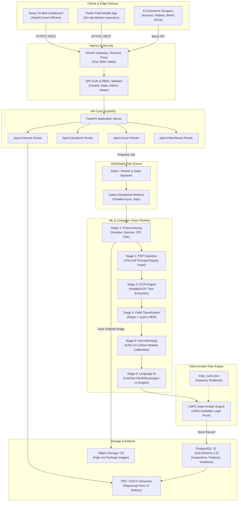

# PackScan System Architecture
**Department of Consumer Affairs (DoCA), Government of India**

---

## High-Level Architecture Diagram

---

## Core Pipeline Stages

1. **Edge Acquisition**: Field inspectors capture package images via Flutter mobile app or upload via the web dashboard. Images are normalized to 300 DPI equivalent.
2. **Principal Display Panel (PDP) Detection**: YOLOv8 models isolate the principal facing surface of the package (Rules 5 and 7).
3. **Multi-Scale OCR**: PaddleOCR detects textual bounding boxes across angles and orientations.
4. **Hybrid Statutory Field Classification**:
   - First-pass deterministic regex pattern matchers parse structured values (MRP, Dates, Net Quantities).
   - Second-pass spaCy Named Entity Recognition models classify ambiguous manufacturer addresses and consumer grievance clauses.
5. **Optical Font Metrology**: Converts pixel bounding box heights into physical millimeters using barcode module width (0.33mm) calibration.
6. **Deterministic Rule Engine**: Completely isolated, audit-ready rule engine evaluates extracted data against `lmpc_rules.json`. Zero hallucinations; legally defensible in court.
7. **Statutory Form VI Notice Generation**: Auto-generates summons, inspection reports, and compounding notices under Section 15 of the Legal Metrology Act, 2009.
